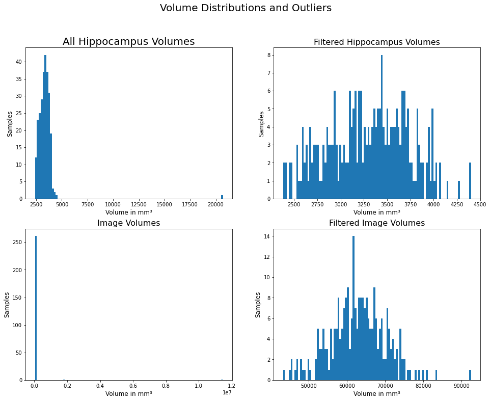

# FDA  Submission

**Your Name:** Manuel Mendoza.

**Name of your Device:** Deep Learning Model for Hippocampal Volume Quantification.

## Algorithm Description

### 1. General Information

**Intended Use Statement:**
 This algorithm is intended only to assists radiologists in estimating the hippocampal volume of a patient on MRI head imaging. It should not be used as a substitute for radiologists or any clinician in the clinical setting.

**Indications for Use:**
 This algorithm could be applied in MRI studies of both male and female patients. The results of the study must be cropped to the hippocampus area of the brain.

**Device Limitations:**
 The architecture applied for this model, although working with convolutional layers, runs at a decent rate in devices with no GPU or any specialized processor.

### 2. Algorithm Design and Function

**DICOM Checking Steps:**
 The DICOM file must present a value of HippoCrop in the header's SeriesDescription attribute.

**Preprocessing Steps:**
 The preprocessing steps are:
1. Extracting pixel data from the DICOM file.
2. Normalizing pixels by dividing them by the maximum value presented in the array.
3. Resize tensor into a `(1, 1, ImageOriginalShape)` shape. Example: if the image dimensions are `(400, 400)`, the new tensor would be `(1, 1, 400, 400)`

**CNN Architecture:**
 The model's architecture is a `U-Net`[1].

### 3. Algorithm Training

**Parameters:**

List of parameters used to train the model:

| Parameter     | Value     |
|---------------|-----------|
| Batch size    | 16        |
| Learning rate | 0.0002    |
| Epochs        | 5         |

**Training dataset:**
 Samples consisted of MRI head images cropped to the hippocampus area of the brain. Labels consisted of the same images with manually produced segmentation of the target areas: the anterior and posterior zones of the hippocampus.

**Performance metrics:**
 To evaluate the model, two metrics were taken into consideration: Jaccard score and Dice score.

### 4. Databases
The EDA analysis showed a normal distribution for the hippocampus volumes centered about the 3500 mm³.

**Figure 1.** Hippocampus and Total Volume Distribution

### 5. Ground Truth
Ground Truth for this dataset is not so far away since labels were determined by radiologists who did the annotations manually. Nevertheless, to ensure the highest precision, three to four radiologists could label the samples individually and save the selected segments with the ID of the area (1 - anterior, 2 - posterior) and the number of radiologists that selected each pixel. From there on, this counter value could be used as the data scientists considered the best, but it would still represent the true outcomes of the labeling process.

### 6. FDA Validation Plan

**Patient Population Description for FDA Validation Dataset:**
 The patients' population should consist of males and females, both genders should have a equal proportion of cases.

**Algorithm Performance Standard:**
 This model achieved a mean Dice score of `4.4476` and a mean Jaccard score of `0.8193`. This values were obtain from 26 test samples.

### 7. Bibliography
1. Ronneberger, O. et al. U-Net: Convolutional Networks for Biomedical Image Segmentation. (2015). [https://arxiv.org/pdf/1505.04597.pdf](https://arxiv.org/pdf/1505.04597.pdf)
